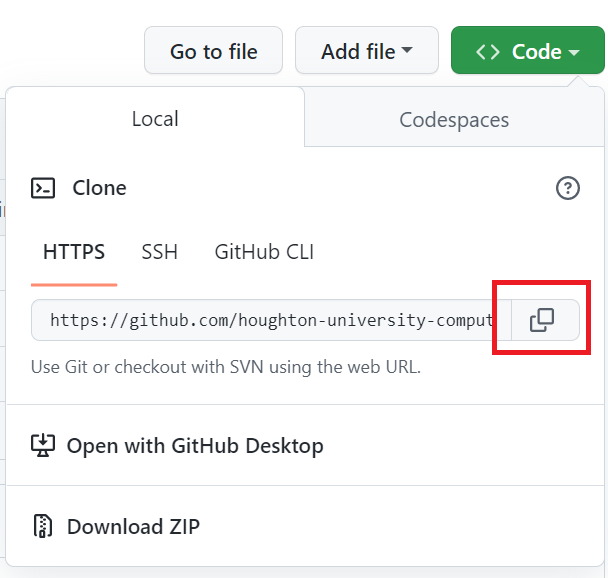

# In-Class Activity #1

This activity has you review basic Python. I recommend using the following websites to help with this review:

- [W3 Python Tutorial](https://www.w3schools.com/python/)
- [Python Cheatsheet](https://www.pythoncheatsheet.org/)

To get started, you'll need to create a folder to store activities for this course. I used the folder name ```activities```. 
Navigate to this folder in git bash. Click on the "copy" button displayed on this git page.



In the console, run

```
git clone your_url_here
```

where ```your_url_here``` is the copied address. This will download a copy of the assignment. It'll be in a subfolder that begins with
```in-class-activity-1...```. Navigate to this folder. 
Run the command

```
py -3.7 -m venv virtualenv
```

to create a virtual environment for this activity. To activate this virtual environment, run

```
source virtualenv/Scripts/activate
```

For this activity, you will need to install a python package. Run:

```
pip install pytest
```

Run the command:

```
pytest
```

This will generate several errors. The file ```review_test.py``` is used by ```pytest``` to test if ```review.py``` has functions that meet certain specifications.
You can find these specifications in ```review_test.py```.
Add functions to ```review.py``` to satisfy the tests in ```review_test.py```.
Once you've completed these tests, you can update your activity on github by running:

```
git add .
git commit -m "your message here"
git push -u origin master
```
